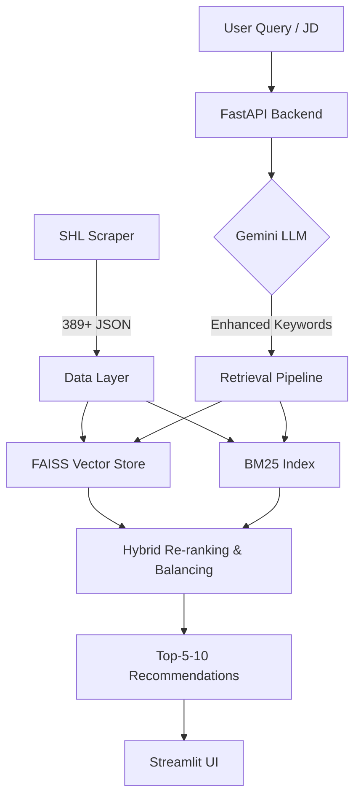

# SHL Assessment Recommender v2.0 🎯

A production-ready, GenAI-powered web application for recommending SHL assessments based on natural language queries or job descriptions.

## 🌟 Key Features

- **Full Catalog Scraper**: Dynamically scrapes over 380+ Individual Test Solutions directly from SHL's product catalog.
- **Advanced RAG Pipeline**: Combines dense representation (FAISS + all-MiniLM-L6-v2) with sparse keyword matching (BM25) via Reciprocal Rank Fusion (RRF) for optimal recall.
- **Smart Recommendations**: Balances results intelligently between "Knowledge & Skills" and "Personality & Behavior" assessments.
- **LLM Enhanced Queries**: Utilizes Google Gemini to automatically extract skills, roles, and intent from vague job descriptions.
- **Premium Frontend**: Modern, dark-themed Streamlit UI built for speed and aesthetics.
- **Comprehensive Evaluation**: Includes an automated module for computing Mean Recall@10 against a structured ground-truth dataset.

## 🏛️ Architecture



## 🚀 Quick Start

### 1. Requirements

- Python 3.9+
- Optional: `GOOGLE_API_KEY` for Gemini LLM query enhancement (System falls back to standard RAG if not provided).

```bash
pip install -r requirements.txt
```

### 2. Initial Setup

Build the FAISS vector index and clean the scraped data from SHL.
```bash
python main.py --setup
```

If you need to completely re-scrape the catalog from scratch:
```bash
python main.py --scrape
```

### 3. Run the App

Start the **FastAPI Backend**:
```bash
python main.py --api
# Runs on http://localhost:8000
```

Start the **Streamlit Frontend** (in a second terminal):
```bash
python main.py --frontend
# Runs on http://localhost:8501
```

## 📊 Evaluation & Metrics

We provide a dedicated evaluation pipeline using `Gen_AI Dataset (1).xlsx` to measure real-world performance based on Mean Recall@10.

**Run Baseline vs Improved RAG:**
```bash
python main.py --compare
```

**Generate Predictions for Submission:**
```bash
python main.py --evaluate
```
This saves detailed metrics to `data/evaluation_results.json` and outputs your final predictions trace to `data/predictions.csv`.

## 📂 Project Structure

- `scraper/` - Web scraping scripts via BeautifulSoup
- `embeddings/` - FAISS index creation and persistent storage
- `retriever/` - Hybrid RRF pipeline and K/P type balancer
- `api/` - Production-ready FastAPI endpoints
- `frontend/` - Streamlit User Interface
- `evaluation/` - Automated metrics (Recall@10) + CSV export
